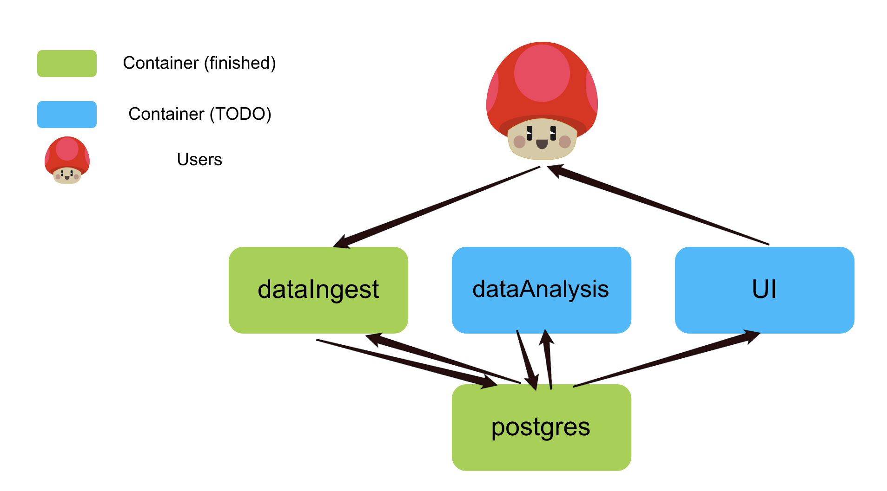

kiva-demo
=========

Requires
--------

Docker_

.. _Docker: https://www.docker.com/

Usage
-----

Bring up the applications with

.. code-block:: bash

    $ docker-compose up

The data ingest application is running on port 4000. Observe that it is up with

.. code-block:: bash

    $ curl localhost:4000

    Hello, world!

Initiate a data pull with

.. code-block:: bash

    $ curl localhost:4000/data

If this returns a 204, it *was* successful. The data isn't exposed by the data ingest application so there is no other way of verifying this (well, no other *intended* way).

To give an idea of other features that might be useful, there is a *schedule* endpoint too:

.. code-block:: bash

    $ curl localhost:4000/schedule

    This is the current schedule

    $ curl -X POST localhost:4000/schedule

    Schedule updated

Architecture
------------

